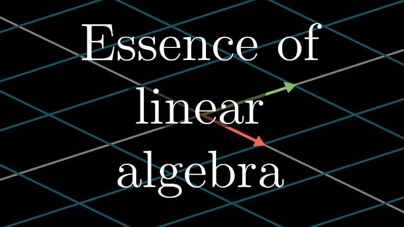

# Essence of Linear Algebra — Notes

My Handwritten Notes from 3Blue1Brown's [Essence of Linear Algebra](https://youtube.com/playlist?list=PLZHQObOWTQDPD3MizzM2xVFitgF8hE_ab) playlist, split into one PDF per chapter.

| File | Chapter(s) |
|---|---|
| `01 - Vectors.pdf` | 1 |
| `02 - Linear combinations, span, and basis vectors.pdf` | 2 |
| `03 - Linear transformations and matrices.pdf` | 3 |
| `04-05 - Matrix multiplication as composition + Three-dimensional linear transformations.pdf` | 4–5 |
| `06 - The determinant.pdf` | 6 |
| `07-08 - Inverse matrices, column space and null space + Nonsquare matrices as transformations between dimensions.pdf` | 7–8 |
| `09 - Dot products and duality.pdf` | 9 |
| `10 - Cross products.pdf` | 10 |
| `11 - Cross products in the light of linear transformations.pdf` | 11 |
| `12 - Cramer's rule, explained geometrically.pdf` | 12 |
| `13 - Change of basis.pdf` | 13 |
| `14-15 - Eigenvectors and eigenvalues + A quick trick for computing eigenvalues.pdf` | 14–15 |
| `16 - Abstract vector spaces.pdf` | 16 |
